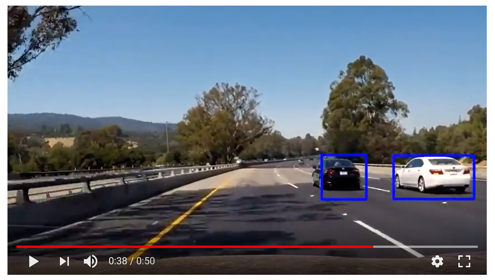

# Vehicle Detection
Project 5 in Udacity self-driving car nanodegree: vehicle detection and tracking

  

Description of our implementation is available [here](writeup.md).

## Setup

Follow instructions [here](https://github.com/udacity/CarND-Term1-Starter-Kit/blob/master/doc/configure_via_anaconda.md) to set up Anaconda environment. You can verify that your environment is set up correctly using the instructions [here](https://github.com/udacity/CarND-Term1-Starter-Kit-Test).

## Files
* Vehicle Detection.ipynb - Jupyter notebook with the code.
* writeup.md - description of vehicle detection and tracking pipeline.
* examples - folder of images used to illustrate the pipeline
* output_videos - folder of test videos with detected objects, created by the code in Vehicle Detection.ipynb.

## Usage
After setting up the environment, open Vehicle Detection.ipynb in Jupyter notebook and run all the cells.
